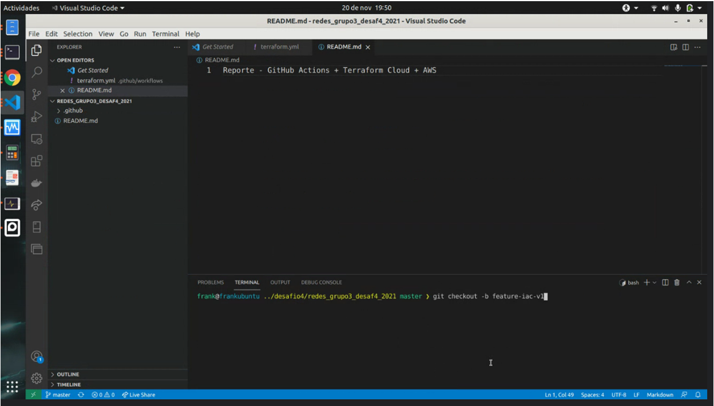
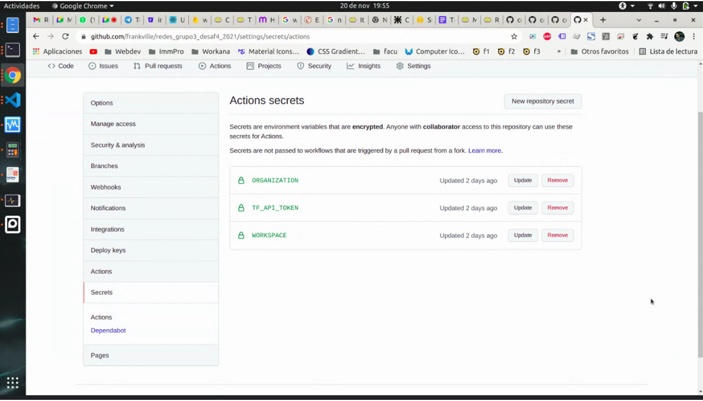
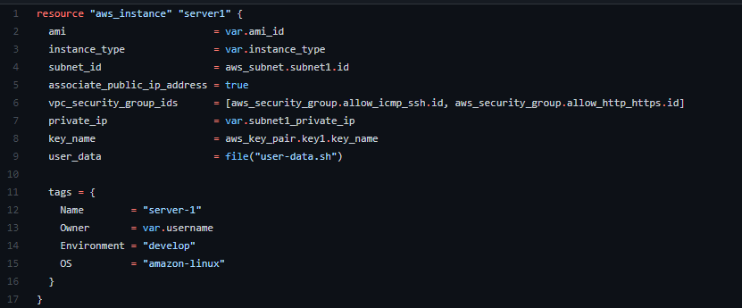
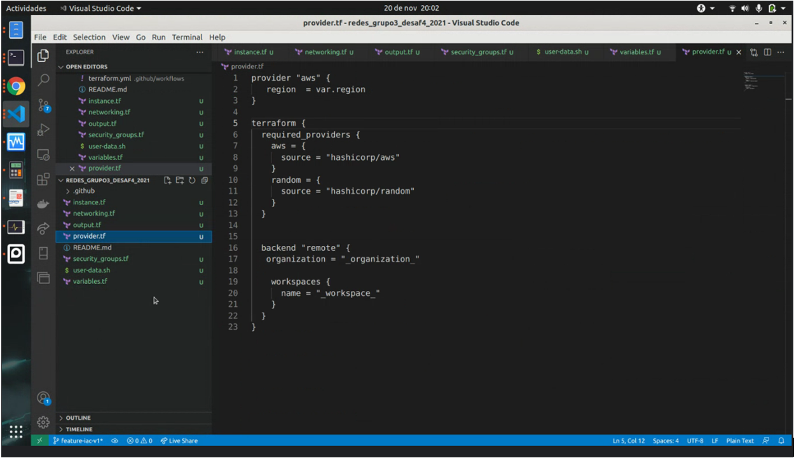

# Reporte - Grupo 3 - Desafío IV - Redes de Información
## GitHub Actions + Terraform Cloud + AWS

### Índice de contenido
1. [Setup del repositorio](#setup-del-repositorio)
2. [Configuración de Colaboradores y Secrets](#configuraci%C3%B3n-de-colaboradores-y-secrets)
3. [Creación de los archivos terraform necesarios](#creaci%C3%B3n-de-los-archivos-terraform-necesarios)
4. [Edición de los archivos terraform segun nuestros requerimientos](#comenzamos-a-editar-los-terraform-seg%C3%BAn-nuestros-requerimientos)
5. [Actualización con Git](#actualizamos-lo-modificado-con-git)
6. [Ejecución correcta de los Recursos](#ejecuci%C3%B3n-correcta-de-los-recursos)
7. [Diagrama de la Infraestructura](#diagrama-de-infraestructura)
8. [Conclusión](#conclusi%C3%B3n )

### Setup del repositorio

En primer lugar, hemos creado un repositorio en Github, cuyo commit inicial corresponde a la configuración del Github Actions que 
con tiene un workflow, configurado mediante el archivo terraform.yml, y relacionado a la ejecución de los comandos en Terraform Cloud.

Hacemos un Branch y creamos una rama nueva para poder hacer a futuro un pull request 

#### Configuración del Github Actions para terraform

#### Configuración de Colaboradores y Secrets 

##### Secrets 

##### Colaboradores 

#### Creación de los archivos terraform necesarios  
##### Utilizamos los archivos .tf dados

#### Cargamos los códigos de terraform brindado por la cátedra 
##### instances.tf

##### networking.tf

##### output.tf

##### provider.tf

##### security_groups.tf

##### user-data.sh

##### variables.tf

##### Creamos una variable para el Internet Gateway Id

##### Creamos una variable para el vpc1_id

#### Comenzamos a editar los terraform según nuestros requerimientos
##### VPC dada: 172.16.0.0/16
##### SubNet a crear: 172.16.3.0/28

##### networking.tf 

##### security_groups.tf 

##### variables.tf 

##### instances.tf 

##### output.tf 

#### Actualizamos lo modificado con Git

##### Agregamos cambios con Git add.

##### Hacemos commit

##### Ejecutamos Push

##### Creamos el pull request

#### Ejecución correcta de los recursos

### Diagrama de Infraestructura 

### Conclusión

En este desafío hemos podido aprender de manera básica algunos elementos de la infraestructura en la nube de AWS que ha enriquecido nuestro conocimiento en cuanto a las posibilidades que nos brinda la IaaS (infrastructure as a Service). También las ventajas de gestionar la infraestructura como código (IaC). 
Al desarrollar los requerimientos afianzamos los conocimientos adquiridos a lo largo de la materia, específicamente en el área de subnetting. 
Para mejorar la disponibilidad, podemos configurar un ELB (Elastic Load Balancer) de tipo ALB(Application Load Balancer), que pueda balancear la carga entre dos o más zonas de disponibilidad, donde en cada zona podríamos tener una configuración similar en cuanto a VPC y Subred, a las cuales tendremos vinculadas instancias de EC2.
En cuanto a la seguridad, una mejora consiste en utilizar un host bastión, al que las personas se conectarían por medio de ssh,  exclusivamente mediante una VPN. De esta manera reducimos drásticamente la superficie de ataque.
Otra mejora puede basarse en limitar la cantidad de conexiones abiertas o generadas en un lapso de tiempo para un host. También limitar las IP que pueden abrir sesiones de SSH o hacer peticiones HTTP.

